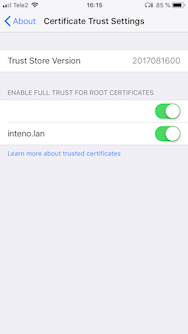

# himinds-iot-project-general-self-signed-certificate

In order to use HTTPS and establish a secure websocket connection, we need certificates. It can be purchased from a certificate authority (CA), or we can create our own, i.e. a self-signed certificate. 
A self-signed certificate is a certificate that is signed by the person creating it rather than a trusted certificate authority (CA).

Why do you create a self-signed-certificate?
Well, it can be used for testing purposes or internal usage.

If you create a certificate, you usually need to handle that the certificate validation fails. As an example, if you use curl, this is done by using the -k (or --insecure) option.

```
curl -k -i -H  "Accept: application/json" "https://localhost:8080/api"
```

This is how I generate my SSL keys:

```
sudo openssl req -x509 -nodes -days 365 -newkey rsa:2048 -keyout server.key -out server.cert
```

You will have to answer several questions, but the most important question is the "Common Name (eg, your name or your server's hostname) []". It needs to be either the IP of your server, example -subj /CN=192.168.1.1 if you are running your local server on IP 192.168.1.1 or a domain name that you control. One easy way of managing the domain name is to [modify your hosts file](https://www.howtogeek.com/howto/27350/beginner-geek-how-to-edit-your-hosts-file/).

These keys will work in mobile app in an iOS environment,  but you need to install the public key server.cert on your device. You can, for example, send it to yourself in an e-mail and then install it from your mail app. On an iOS device, you then need to go to /Settings/General/About and scroll down to "Certificate Trust Settings", select and then activate the certificate. As shown in the picture below:



Now you are done!
